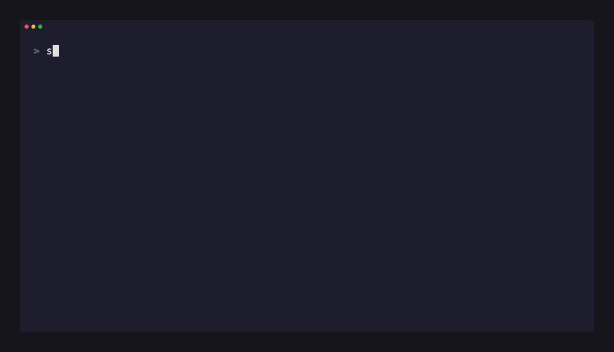
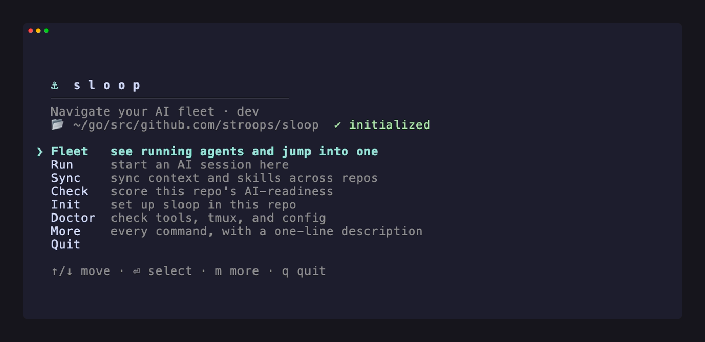

# ⚓ Sloop

> **The local-first control layer for your AI coding CLIs.**
> One canonical context for every tool, one cross-repo view of every agent you're running.

[Documentation](docs/guide/USAGE.md) · [Roadmap](ROADMAP.md)

Sloop is a single Go binary that sits **above** your AI coding tools: Claude Code, Cursor CLI,
Codex CLI, Copilot CLI, Gemini CLI, Google Antigravity, and whatever comes next. It doesn't replace
them or proxy their models; it removes the friction of running several of them, across several repos,
at once.

<p align="center">
  
</p>

<p align="center"><em><code>sloop ps</code>: one board for every agent, across every repo. Answer a waiting one in a single key.</em></p>

---

## What it solves

Three things get awkward once you run more than one agent:

| Problem | What sloop does |
|---|---|
| Each agent runs in its own terminal, so you lose track of who's waiting and who's working. | `sloop ps` lists every agent across every repo, waiting ones first; jump, reply, or kill in place. |
| Each tool wants its own instructions file (`CLAUDE.md`, `GEMINI.md`, …), so guidance drifts. | Write `AGENTS.md` once; each tool reads it natively or via a thin pointer file. Skills are symlinked into each tool. |
| Skills, hooks, and standard folders differ per provider, so setup is ad-hoc. | One adapter manifest per tool holds all of it. Adding a CLI is adding a file, not editing Go. |

One CGO-free binary: no daemon, no cloud, no required services. State stays on your machine.

---

## Install

### 1. Install Sloop

**macOS / Linux (Homebrew)**
```sh
brew install stroops/tap/sloop
```

**Go (Any platform)**
```sh
go install github.com/stroops/sloop/cmd/sloop@latest
```

*Prebuilt binaries are also available on the [Releases](https://github.com/stroops/sloop/releases) page.*

### 2. Install a Multiplexer (Required for background agents)

The fleet commands (`run`, `ps`, `peek`, …) launch agents inside a multiplexer so they keep running when you step away.

**macOS / Linux (tmux)**
```sh
brew install tmux   # or: apt install tmux
```

### 3. Verify Setup

```sh
sloop doctor                     # confirm your AI tools + multiplexer are detected
source <(sloop completion zsh)   # optional shell completion (bash / fish too)
```

**Upgrading Sloop**

Whenever a new version is released, simply run:
```sh
sloop update
```
*(Sloop will automatically detect if you installed via Brew, Scoop, Go, or downloaded the binary directly, and run the correct upgrade process).*

---

## Quick start

```sh
cd ~/code/my-service
sloop init                   # scaffold AGENTS.md + .sloop/, deliver CLAUDE.md, register the repo
$EDITOR AGENTS.md            # write your project guidance once

sloop run claude             # sync context, then launch claude (inside tmux if present)
sloop hooks install          # let `sloop ps` know exactly when an agent is waiting
sloop statusline install     # the tool reports its model + context % into the status bar

# …open more agents in more repos…
sloop ps                     # the whole fleet: who's waiting, who's working, across every repo
```

Running **`sloop`** with no arguments opens an interactive menu over the common commands:

<p align="center">
  
</p>

In `sloop ps`: `↑/↓` move · `Enter` jump in · `1`/`y` answer a waiting agent · `s` send a line ·
`x` kill · `q` quit.

---

## How tmux fits in

The orchestration features (`ps`, `run --split`, `send`, `attach`, `peek`, `popup`) run agents inside
a terminal multiplexer so they keep running when you step away. Everything else (`init`, `sync`,
`check`, `doctor`, …) works without one.

- **Sloop drives tmux; it doesn't replace it.** It shells out to `tmux` (or **psmux** on native
  Windows, auto-detected; override with `SLOOP_MUX`). Install: [tmux] / [psmux].
- **One session per agent, named `<workspace>__<tool>`** (e.g. `api__claude`). That single rule is
  what makes the fleet board, `send`, and `attach` possible, with nothing untracked to lose.
- **`Enter` attaches, detaching keeps it running.** Step out with your tmux prefix then `d`
  (`Ctrl+b d`, or `Ctrl+a d` if remapped); the agent keeps going and you land back at the fleet.
  Every session's status bar keeps you oriented: the left shows **status · workspace·tool · model ·
  context % · git branch** (plus a badge when other agents wait) — everything worth knowing at a
  glance, on the side tmux never truncates first; the right just rotates hints like
  `💡 detach: <prefix> d` so you always know the way back.
- **Sloop never touches your `~/.tmux.conf`.** The status bar is set per-session; disable it with
  `SLOOP_STATUSLINE=0`. `peek` and `popup` overlay an agent in a floating popup (needs tmux ≥ 3.2).
- **Across reboots:** tmux sessions live in memory, so a restart ends them (sloop is not
  tmux-resurrect). The **registry** survives, so `sloop ls` / `sloop ps --all` still show your
  workspaces and `sloop restore` relaunches the fleet.

[tmux]: https://github.com/tmux/tmux/wiki/Installing
[psmux]: https://github.com/psmux/psmux

---

## A second agent, or a second account

```sh
sloop run claude@review                              # a 2nd claude in the same repo → claude·review
sloop run claude --new                               # auto-named next one → claude·2
sloop new claude -N -t "fix the flaky CI test"       # same, but detached: spawn it and keep your terminal
sloop profile add work --config-dir ~/.claude-work   # save a 2nd account once…
sloop run @work                                      # …and launch under it from any repo
```

`--config-dir` is the friendly form: you name the directory, sloop maps it to the tool's account
variable (`CLAUDE_CONFIG_DIR` for Claude), offers to create it if missing, and offers to symlink your
plugins/skills/agents from your main config. Your login (`.credentials.json`) is never shared. Today
this works for **Claude Code**; other CLIs follow as their account model is mapped into the adapter.

---

## Commands

The handful you'll use most. Full reference, with every command and flag:
**[docs/guide/USAGE.md](docs/guide/USAGE.md)**.

| Command | Alias | What it does |
|---|---|---|
| `init` | - | Scaffold `AGENTS.md` + `.sloop/`, deliver pointers, register the workspace (`--scan` pre-fills from the codebase). |
| `run [tool]` | `r` | Sync context, then launch a tool. `tool@instance` / `--new` for a 2nd agent; `@profile` for another account; `--split` for side-by-side. |
| `new [tool]` | - | `run` without the attach: spawn the agent in the background and keep your terminal (`-a` attaches, `-N` forces a fresh instance). |
| `ps [#]` | - | The cross-repo fleet. `<#>` jumps; `-f` live-monitors and alerts when an agent needs you. |
| `ls` | - | Registered workspaces (running or not) with their live agents. |
| `peek [agent]` | `pk` | Overlay a waiting agent in a floating popup, answer it, drop back, without leaving your current screen (tmux ≥ 3.2). |
| `popup` | `hud` | Open the whole fleet (`ps`) as a floating popup / HUD (tmux ≥ 3.2). |
| `profile add\|ls\|rm` | `prof` | Save reusable run profiles (e.g. a 2nd account) in `~/.sloop/config.yaml`. |

---

## Philosophy & non-goals

- **Build on existing tools.** Sloop syncs context and orchestrates sessions; it never proxies an LLM
  or replaces a CLI.
- **Local-first & lightweight.** One CGO-free binary, no daemon, no cloud.
- **Canonical source, never clobbered.** `AGENTS.md` is yours; delivery is create-if-missing.
- **Not** an in-repo multi-agent orchestrator with worktrees/dashboards (tools like ntm and Claude
  Squad own that lane). Sloop's edge is **portable context + the cross-repo fleet view**.

## Docs

- [docs/guide/USAGE.md](docs/guide/USAGE.md): hands-on guide, every command with examples
- [docs/reference/CONFIG.md](docs/reference/CONFIG.md): the three config layers (local / global / built-in)
- [docs/reference/ADAPTERS.md](docs/reference/ADAPTERS.md): the provider-aware adapter contract (add a CLI = add one YAML file)
- [docs/reference/ARCHITECTURE.md](docs/reference/ARCHITECTURE.md): workspace layout, delivery, data flow, internals
- [ROADMAP.md](ROADMAP.md): pillars, what's next (v0.2.0 workflow hooks), how to contribute

## License

**MIT**. See [LICENSE](LICENSE).
